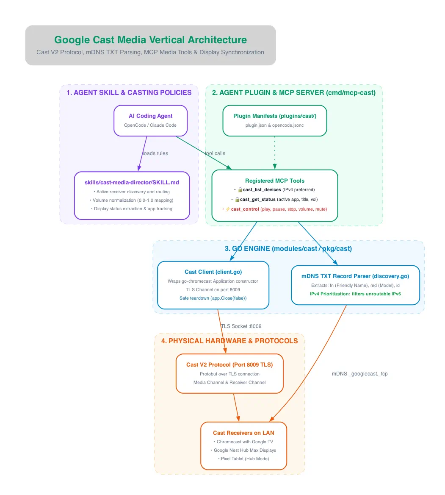

The Google Cast vertical integrates `homectl` with Chromecasts, Google TV Streamers, and Google Nest Hub displays across the local network.

---

## Architectural Diagram

---

## Key Components & Protocol Flow

### 1. Agent Skill & Policy Layer (`skills/cast-media-director`)
* **Receiver Routing:** Discovers active display receivers and routes media playback to the appropriate device based on user room context.
* **Volume Normalization:** Maps human-readable volume percentages (0–100%) to the Cast SDK's internal floating-point scale (0.0–1.0).
* **Display Status & App Tracking:** Inspects active receiver channels to determine if a screen is actively streaming or resting on the backdrop screen.

### 2. Standalone MCP Server (`cmd/mcp-cast`)
* `cast_list_devices` (🔒 Read-Only): Lists all discovered Cast devices with friendly names, models, and clean IPv4 addresses.
* `cast_get_status` (🔒 Read-Only): Queries active receiver application (`app_id`, `display_name`), current volume, mute status, and status text.
* `cast_control` (⚡ Mutating): Issues media transport actions (`play`, `pause`, `stop`, `volume`, `mute`, `unmute`).

### 3. Go Engine (`modules/cast` / `pkg/cast`)
* **`go-chromecast` Encapsulation:** Uses `application.NewApplication(application.WithCacheDisabled(true))` to guarantee internal cache initialization and eliminate nil-pointer panics.
* **IPv4 Prioritization:** mDNS discovery for `_googlecast._tcp` inspects TXT records (`fn`, `md`, `id`) and explicitly prioritizes `AddrIPv4` addresses, discarding unroutable or link-local IPv6 addresses (`fd7a:...`) so web clients and APIs connect reliably.
* **Resource Cleanup:** Enforces `defer app.Close(false)` on all socket connections to prevent orphaned TLS channels on target devices.

### 4. Physical Devices & Cast V2 Protocol
* **Port 8009 TLS:** Communication uses protocol buffer (protobuf) frames transmitted over an authenticated TLS socket on port `8009`.
* **Hardware:** Works across Chromecast with Google TV, Nest Hub Max, Google Home Mini, and third-party TVs with built-in Chromecast support.
