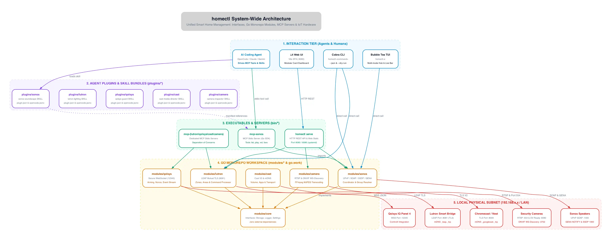

`homectl` is structured as a modular smart home control platform. It decouples device-level protocols from user-facing applications (CLI, TUI, and Web UI) while providing standalone **Agent Plugins** and **Model Context Protocol (MCP)** servers for autonomous AI agents.

---

## High-Level Architecture Diagram

---

## Architectural Tiers

### 1. Interaction Tier (Humans & AI Agents)
* **AI Coding Agents (OpenCode, Claude, Gemini):** Interact with `homectl` via Model Context Protocol (MCP) tool calls over standard I/O (stdio). Agent reasoning is guided by declarative **Agent Skills** (`skills/<name>/SKILL.md`) that codify safety rules, token economics, and error recovery protocols.
* **Cobra CLI (`cmd/`):** Scriptable command-line interface supporting human-friendly tabular output and machine-readable structured output via the `--json` flag. All mutating commands support `--dry-run` simulation.
* **Bubble Tea TUI (`pkg/tui`):** Responsive terminal dashboard featuring multi-mode tab navigation (Lights, Music, Areas), live volume and dimming progress bars, and inline nickname editing.
* **Lit Web UI (`ui/`):** Fast, reactive single-page application built with Lit WebComponents and Vite. Utilizes an isolated "smart parent / dumb card" component architecture with optimistic state updates.

### 2. Agent Plugin Tier (`plugins/<svc>/`)
Each integrated IoT ecosystem is packaged as a self-contained Agent Plugin adhering to the **Agent Plugins Specification 1.0.0**:
* **`plugin.json`**: Plugin metadata, semantic version, and author declaration.
* **`mcp.json`**: Standard MCP server registration defining stdio execution (`mcp-<svc>`).
* **`opencode.jsonc`**: Native OpenCode configuration format mapping local binary paths.
* **`skills/<name>/SKILL.md`**: Canonical skill rules synchronized automatically from top-level `skills/` via `make sync-skills`.

### 3. Service Gateway & MCP Servers (`bin/*`)
* **`homectl serve`**: HTTP API server running on port `8080` (or `8086` under `systemd`), providing REST endpoints (`/api/lutron/*`, `/api/sonos/*`, `/api/cast/*`, `/api/security/*`) and hosting compiled Web UI assets.
* **Standalone MCP Servers (`cmd/mcp-<svc>/`)**: Dedicated micro-executables (`mcp-sonos`, `mcp-lutron`, etc.) built with `@modelcontextprotocol/go-sdk`. Each server enforces strict separation of concerns, ensuring an agent only loads the tools relevant to its current domain.

### 4. Disaggregated Go Monorepo (`modules/*`)
The Go codebase is organized as a multi-module workspace (`go.work`):
* **`modules/core`**: Interface-only foundational module defining injectable primitives:
  * `core.Storage`: Abstract filesystem operations (XDG standard vs. in-memory for testing).
  * `core.Logger`: Pluggable structured and standard loggers without global `init()` side-effects.
  * `core.Settings`: Configuration parameters (e.g. `CallbackIP` for inbound NAT traversal).
* **Per-Service Domain Modules (`modules/sonos`, `modules/lutron`, etc.)**: Encapsulate protocol clients, state management, and network calls. Each module contains its own isolated `go.mod` and comprehensive mock-transport test suites.

### 5. Local Physical Subnet Tier
`homectl` interacts directly with hardware on the local network (`192.168.x.x`):
* **Lutron Smart Bridge Pro:** Mutual TLS connection on port `8081` using the LEAP protocol.
* **Sonos Whole-Home Audio:** SOAP calls over HTTP port `1400`, SSDP multicast discovery on UDP `1900`, and inbound GENA push notifications.
* **Google Cast:** Encrypted TLS channel on port `8009` with mDNS discovery (`_googlecast._tcp`).
* **Security Cameras:** RTSP H.264 video streaming on port `554`, Omnivision control on port `6080`, and ONVIF WS-Discovery on UDP `3702`.
* **Qolsys IQ Panel 4:** Encrypted WebSocket stream on port `12345` (`wss://`).

---

## State & Privacy Isolation

* **Runtime State (`~/.config/homectl/`):** Adheres to the XDG Base Directory specification. Stores user settings (`config.json`), device nicknames (`nicknames.json`), and discovery caches (`lutron_cache.json`, `sonos_cache.json`).
* **Private State (`local/`):** The repository includes a strictly gitignored `local/` directory (`local/NETWORK_DISCOVERY.md`, local TLS certificates) ensuring real physical MAC addresses, static IPs, and residential layouts are never committed or published to public repositories.
