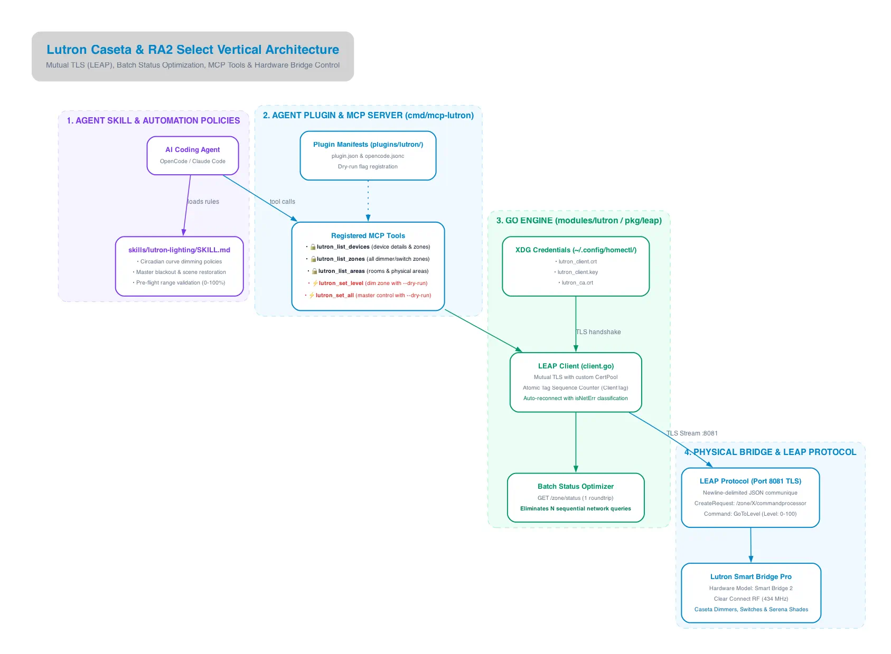

The Lutron vertical provides local control of Lutron Caseta and RA2 Select systems. It bypasses the Lutron cloud entirely, executing encrypted commands directly on the local Smart Bridge.

---

## Architectural Diagram



---

## Key Components & Protocol Flow

### 1. Agent Skill & Rules (`skills/lutron-lighting`)
* **Circadian Lighting Automation:** Instructs AI agents on color temperature and dimming curves across time of day.
* **Pre-Flight Range Validation:** Guards against out-of-range dimming commands (`level < 0` or `level > 100`).
* **Blackout / Scene Control:** Guides master shutoff workflows (`lutron_set_all(0)` with `--dry-run` safety).

### 2. Standalone MCP Server (`cmd/mcp-lutron`)
Exposes tools for lighting state and control:
* `lutron_list_devices` (🔒 Read-Only): Lists all smart bridge devices, local zones, and model numbers.
* `lutron_list_zones` (🔒 Read-Only): Enumerates dimming and switching circuits with control types.
* `lutron_list_areas` (🔒 Read-Only): Returns room and area groupings.
* `lutron_set_level` (⚡ Mutating): Adjusts brightness for a specific zone with `--dry-run` simulation support.
* `lutron_set_all` (⚡ Mutating): Broadcasts master dimming level to all zones with safety confirmation.

### 3. Go Engine (`modules/lutron` / `pkg/leap`)
* **Mutual TLS (mTLS):** The Lutron bridge requires client certificates. `pkg/leap` configures a custom `x509.CertPool` using certificates stored in `~/.config/homectl/` (`lutron_client.crt`, `lutron_client.key`, `lutron_ca.crt`).
* **Atomic ClientTag Sequencing:** Each LEAP JSON request is assigned an incrementing atomic tag (`atomic.AddUint64(&tagCounter, 1)`). The client matches incoming bridge responses to the initiating tag, ensuring request/response correlation over persistent TLS connections.
* **Batch Status Optimization:** Instead of querying individual `/zone/<id>/status` endpoints sequentially (which scales as $O(N)$ network requests), `homectl` queries the collective `/zone/status` endpoint in a **single roundtrip**.
* **Resilient Auto-Reconnection:** Network dropouts are detected via `isNetErr(err)` (evaluating `io.EOF`, `net.OpError`, and timeout conditions), triggering automatic reconnection before retrying in-flight requests.

### 4. Physical Bridge & LEAP Protocol
* **Port 8081 TLS:** Communcation takes place over newline-delimited JSON payloads:
  ```json
  {
    "CommuniqueType": "CreateRequest",
    "Header": { "Url": "/zone/1/commandprocessor", "ClientTag": "42" },
    "Body": {
      "Command": {
        "CommandType": "GoToLevel",
        "Parameter": [{ "Type": "Level", "Value": 75 }]
      }
    }
  }
  ```
* **Clear Connect RF (434 MHz):** The Smart Bridge broadcasts proprietary Clear Connect signals to wall dimmers, fan controls, and motorized Serena shades.
