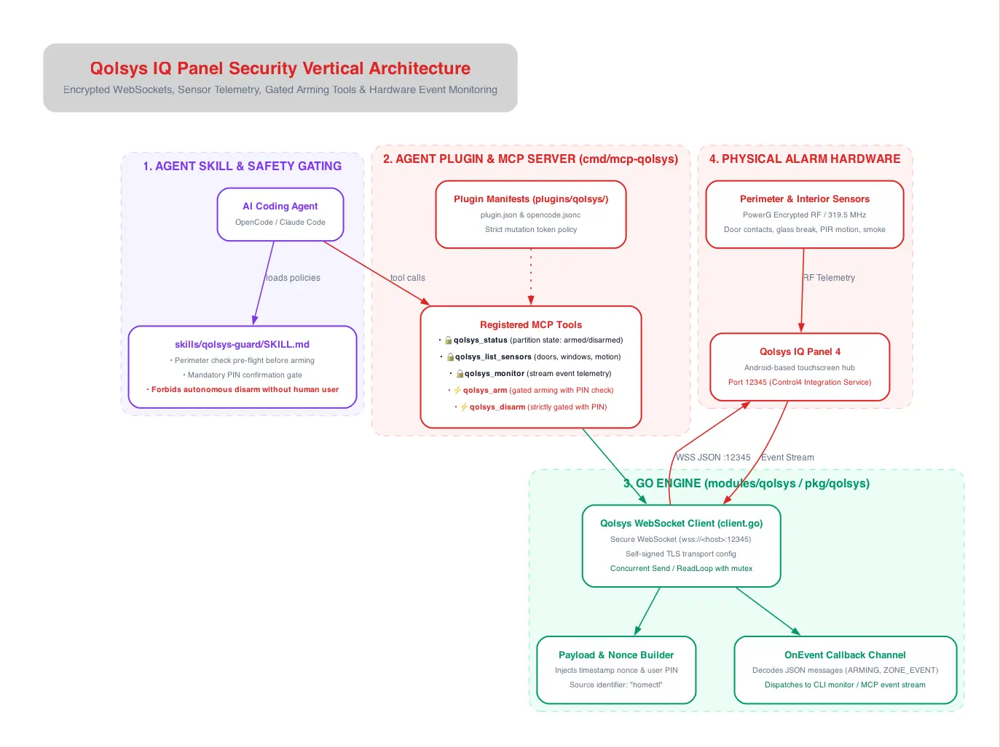

The Qolsys vertical connects `homectl` to Qolsys IQ Panel 2+ and IQ Panel 4 residential alarm panels, enabling real-time sensor telemetry and safety-gated arming controls.

---

## Architectural Diagram

---

## Key Components & Safety Protocols

### 1. Agent Skill & Strict Gating (`skills/qolsys-guard`)
Because alarm systems are life-safety critical actuators, `skills/qolsys-guard` enforces strict defensive policies:
* **Perimeter Pre-Flight Check:** Before arming, the agent must query `qolsys_list_sensors` to verify that all exterior doors and windows are closed.
* **Mandatory User PIN Verification:** Arming commands require an explicit 6-digit access PIN.
* **Autonomous Disarm Prohibited:** Agents are strictly forbidden from disarming the security system without explicit real-time human approval.

### 2. Standalone MCP Server (`cmd/mcp-qolsys`)
* `qolsys_status` (🔒 Read-Only): Returns partition status (`DISARMED`, `ARMED_STAY`, `ARMED_AWAY`).
* `qolsys_list_sensors` (🔒 Read-Only): Lists door contacts, window sensors, motion detectors, and smoke alarms with open/closed state.
* `qolsys_monitor` (🔒 Read-Only): Streams live event frames to the agent.
* `qolsys_arm` (⚡ Mutating): Safety-gated tool for arming stay or away with PIN check.
* `qolsys_disarm` (⚡ Mutating): Strictly gated disarm tool.

### 3. Go Engine (`modules/qolsys` / `pkg/qolsys`)
* **Secure WebSocket Client (`client.go`):** Connects to `wss://<host>:12345` with self-signed TLS support.
* **Nonce & Payload Builder:** Constructs JSON command frames containing an anti-replay Unix timestamp nonce, the user's PIN token, and the `source: "homectl"` signature.
* **Asynchronous Read Loop:** Operates a background goroutine continuously reading incoming WebSocket frames and dispatching them to the `OnEvent` callback handler.

### 4. Physical Alarm Hardware
* **IQ Panel 4:** Android-powered touchscreen controller hosting the Control4 / 3rd Party Integration service on TCP port `12345`.
* **PowerG & 319.5 MHz RF Sensors:** Long-range, frequency-hopping encrypted sensors (door contacts, motion detectors, glass-break sensors) reporting real-time physical telemetry.
