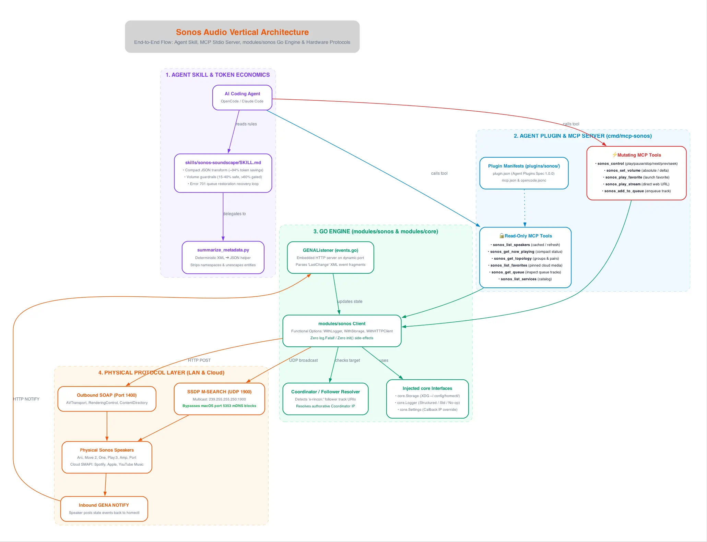

The Sonos audio integration in `homectl` is the pilot implementation of our **Agent Plugin & Go Module Vertical** strategy. It bridges high-level natural language agent commands with low-level UPnP SOAP actions and asynchronous GENA push notifications.

---

## Architectural Diagram



---

## Layer-by-Layer Breakdown

### 1. Agent Skill & Token Economics (`skills/sonos-soundscape`)
Interacting with Sonos devices via raw SOAP produces verbose XML payloads (DIDL-Lite blocks) that consume **1,200–2,000 prompt tokens** per query. The `sonos-soundscape` skill solves this via the **Skill with Code** pattern:
* **Compact JSON Transformation:** Delegates XML parsing to `summarize_metadata.py`, transforming a multi-kilobyte DIDL-Lite fragment into a 40-byte JSON summary (`title`, `artist`, `album`). This yields a **~94% token reduction** per status check.
* **Acoustic Safety Boundaries:** Clamps standard listening levels between **15% and 40%**. Mutating calls exceeding **60%** require explicit user confirmation; volumes over **80%** are blocked.
* **Error 701 Queue Recovery:** Codifies the recovery workflow: if playback fails with UPnP Error `701 (Transition Not Available)`, the agent restores the speaker's local queue (`x-rincon-queue:<RINCON>#0`) or falls back to ambient Sonos Radio before retrying.

### 2. Standalone MCP Server (`cmd/mcp-sonos`)
The MCP server communicates with AI agents over standard I/O using the official `@modelcontextprotocol/go-sdk`:

| Tool | Mode | Schema Wrapper | Description |
| :--- | :---: | :--- | :--- |
| **`sonos_list_speakers`** | 🔒 Read-Only | `ListSpeakersResult{Count, Speakers}` | Discovers or lists cached speakers on LAN. |
| **`sonos_get_now_playing`** | 🔒 Read-Only | `NowPlayingResult` | Compact playback state, progress, and track metadata. |
| **`sonos_get_topology`** | 🔒 Read-Only | `TopologyResult{Count, Groups}` | Exposes zone groups and stereo-pair coordinator/follower relationships. |
| **`sonos_list_favorites`** | 🔒 Read-Only | `ListFavoritesResult{Count, Favorites}` | Lists pinned cloud tracks/playlists from Spotify, Apple Music, and Sonos Radio. |
| **`sonos_control`** | ⚡ Mutating | `{"status": "ok", "action": ...}` | Sends playback actions: `play`, `pause`, `stop`, `next`, `previous`. |
| **`sonos_set_volume`** | ⚡ Mutating | `{"status": "ok", "volume": ...}` | Adjusts absolute volume (0–100) or applies relative step deltas (`+5`, `-10`). |
| **`sonos_play_favorite`** | ⚡ Mutating | `{"status": "ok", "favorite_id": ...}` | Initiates playback of a pinned cloud favorite. |
| **`sonos_play_stream`** | ⚡ Mutating | `{"status": "ok", "url": ...}` | Streams an arbitrary HTTP/HTTPS audio URL (radio, podcast, or TTS). |

All output schemas conform to **MCP SEP-2106** and OpenCode validation rules by returning Go records (JSON objects), never bare arrays.

### 3. Go Engine (`modules/sonos`)
The core domain logic is isolated in `modules/sonos`:
* **Coordinator / Follower Resolution:** In Sonos stereo pairs or groups, secondary speakers report their transport as `PLAYING` with an `x-rincon:<coord>` track URI but empty metadata. `modules/sonos` automatically detects follower nodes, resolves the group coordinator via `GetCoordinatorIP()`, and routes playback commands to the authoritative master speaker.
* **Zero Global State:** Does not rely on global `init()` loggers or hardcoded file paths. All dependencies (`core.Logger`, `core.Storage`, `core.Settings`) are injected via functional options:
  ```go
  client := sonos.NewClient(ip,
      sonos.WithLogger(logger),
      sonos.WithStorage(storage),
      sonos.WithHTTPClient(customHTTP),
  )
  ```
* **Comprehensive Mock Testing:** Tested via `modules/sonos/client_test.go` using `httptest.Server`, covering DIDL-Lite parsing, SOAP error handling, and group topology without requiring physical hardware.

### 4. Physical Protocol Layer
* **Outbound SOAP (Port 1400):** Executes commands against standard UPnP services:
  * `/MediaRenderer/AVTransport/Control`
  * `/MediaRenderer/RenderingControl/Control`
  * `/MediaServer/ContentDirectory/Control`
  * `/ZoneGroupTopology/Control`
* **SSDP M-SEARCH (UDP 1900):** Sends multicast probes to `239.255.255.250:1900` (`ST: urn:schemas-upnp-org:device:ZonePlayer:1`). Bypasses macOS port 5353 multicast conflicts to deliver sub-500ms discovery across all network nodes.
* **Inbound GENA Push Events:** `GENAListener` (`events.go`) launches a background HTTP listener to receive real-time UPnP `NOTIFY` requests containing `LastChange` XML event fragments for instant volume and track synchronization.
